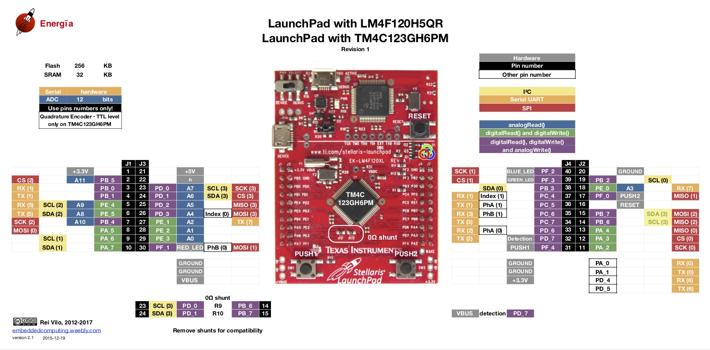

# ARM-TM4C-CCS
This repository contains all my practice codes of TM4C123GXL coded in CCS7.  
The Texas Instruments Tiva C LaunchPad board TM4C123G is used for the code.  
The TM4C123GXL Launchpad has the TM4C123GH6PM microcontroller which is based on the ARM Cortex-M4F 
microcontroller architecture and clocked at 80 MHz (with 100 DMIPS)

  

## Project Contents  

### [TM4C123G LaunchPad Template](./TM4C123G&#32;LaunchPad&#32;Template\)  
**TM4C123G LaunchPad Template** - This represents the project template used for the subprojects in this repository.  

### [TM4C123G LaunchPad Blink with Delay](./TM4C123G&#32;LaunchPad&#32;Blink&#32;with&#32;Delay)  
**Blink with delay** - The program controls the RGB LEDs on the Tiva C board TM4C123G LaunchPad 
(with TM4C123GH6PM microcontroller) and blinks the Blue, Green and Red Led with a specified delay. 
The Delay is generated by wasting machine cycles in a loop.  

### [TM4C123G LaunchPad Blink without Delay](./TM4C123G&#32;LaunchPad&#32;Blink&#32;without&#32;Delay/)  
**Blink without delay** - The program controls the Green LED on the Tiva C board TM4C123G LaunchPad 
(with TM4C123GH6PM microcontroller) and blinks it with a specified time period. 
Timer0 is used to create periodic interrupts to control blinking.  

### [TM4C123G LaunchPad LED Button Control](./TM4C123G&#32;LaunchPad&#32;LED&#32;Button&#32;Control/)  
**LED Button Control** - The program controls the RGB LEDs on the Tiva C board TM4C123G LaunchPad 
(with TM4C123GH6PM microcontroller) using the onboard switches SW1(PF4) and SW2(PF0). 
Different combinations of button presses cause different LEDs to glow.  

### [TM4C123G LaunchPad PWM Servo](./TM4C123G&#32;LaunchPad&#32;PWM&#32;Servo/)  
**PWM Servo** - The program controls the position of an external servo motor by varying the Duty Cycle of the PWM. The Duty 
Cycle can be increased by clicking the onboard switch SW2(PF0) or decreased by clicking SW1(PF4). The PWM module.  
  

### [TM4C123G LaunchPad PWM using GP Timer](./TM4C123G&#32;LaunchPad&#32;PWM&#32;using&#32;GP&#32;Timer/)  
**PWM using General Purpose Timer** - The program controls the intensity of Green LED on the Tiva C board TM4C123G LaunchPad 
(with TM4C123GH6PM microcontroller) by varying the Duty Cycle of the PWM. The Duty Cycle can be increased by clicking 
the onboard switch SW2(PF0) or decreased by clicking SW1(PF4). Timer0 is used to create PWM at fixed frequency but 
variable Duty Cycle.  

### [TM4C123G LaunchPad ADC Potentiometer](./TM4C123G&#32;LaunchPad&#32;ADC&#32;Potentiometer/)  
**ADC Potentiometer** - The program reads the ADC value from an externally connected potentiometer.  
  

### [TM4C123G LaunchPad ADC Temp Sensor](./TM4C123G&#32;LaunchPad&#32;ADC&#32;Temp&#32;Sensor/)  
**ADC reading from Temperature Sensor** - The program reads the ADC value from the Temperature sensor in the 
TM4C123GH6PM chip. This is then converted to Celsius and Fahrenheit scale.  

### [TM4C123G LaunchPad UART](./TM4C123G&#32;LaunchPad&#32;UART/)  
**UART** - The program reads the input from a user on the serial monitor (terminal) and echoes it back to the user. 
Serial Activity is displayed by the Blue Led which glows for 1ms on every UartRx.

### [TM4C123G LaunchPad UART Stdio](./TM4C123G&#32;LaunchPad&#32;UART&#32;Stdio/)  
**UART Stdio** - The program reads the input from a user on the serial monitor (terminal) and echoes it back to the user. 
Serial Activity is displayed by the Blue Led which glows for 1ms on every UartRx. The code demonstrates the use of UARTprintf() API of uartstdio.h library for printing strings.  

### [TM4C123G LaunchPad Quadrature Encoder](./TM4C123G&#32;LaunchPad&#32;Quadrature&#32;Encoder/)  
**Quadrature Encoder** - The program interfaces the quadrature encoder peripheral to get the position and velocity 
information of a encoded DC motor. The QEI1 peripheral is used with PortC using PC4, PC5 and PC6 as Index1, PhA and PhB.  
  

### [TM4C123G LaunchPad PI Motor Control](./TM4C123G&#32;LaunchPad&#32;PI&#32;Motor&#32;Control/)  
**PI Motor Control** - The program interfaces the QEI and PWM peripherals to implement a PI Position control of an Encoded 
DC Motor. The Motor used is Faulhaber 12V(17W) Coreless motor, 64:1 Planetary gearbox, 120RPM, 12 PPR Encoder. 
This gives 3072 CPR of quadrature.  
  

### [TM4C123G LaunchPad PID with UART](./TM4C123G&#32;LaunchPad&#32;PID&#32;with&#32;UART/)  
**PID with UART** - The program interfaces the QEI, PWM and UART peripherals to implement a PID Position control of an 
Encoded DC Motor. The Motor used is Faulhaber 12V(17W) Coreless motor, 64:1 Planetary gearbox, 120RPM, 12 PPR Encoder. 
This gives 3072 CPR of quadrature.  
  

### [TM4C123G LaunchPad FPU Co-Processor](./TM4C123G&#32;LaunchPad&#32;FPU&#32;Co-Processor/)  
**FPU Co-Processor** - The program enables the Floating Point Unit Co-Processor which is 
used to calculate a sine wave with a specified number of sampling points.  

### [TM4C123G LaunchPad PID with UART and FPU](./TM4C123G&#32;LaunchPad&#32;PID&#32;with&#32;UART&#32;and&#32;FPU/)  
**PID with UART and FPU** - The program interfaces the QEI, PWM and UART peripherals to implement a PID Position control of 
an Encoded DC Motor. The Motor used is Faulhaber 12V(17W) Coreless motor, 64:1 Planetary gearbox, 120RPM, 12 PPR Encoder. 
This gives 3072 CPR of quadrature. Also the FPU is used for the floating point calculations during PID.  
  

### [TM4C123G LaunchPad Ultrasonic HC-SR04](./TM4C123G&#32;LaunchPad&#32;Ultrasonic&#32;HC-SR04/)  
**Ultrasonin HC-SR04** - This is a sample code for HC-SR04. The code calculates the distance of an obstacle from the 
HC-SR04 sensor and publishes the data over the UART channel.  
  

### [TM4C123G LaunchPad Workshop](./TM4C123G&#32;LaunchPad&#32;Workshop/)  
**TM4C123G LaunchPad Workshop** - This contains all the codes of  Tiva-C workshop.   

